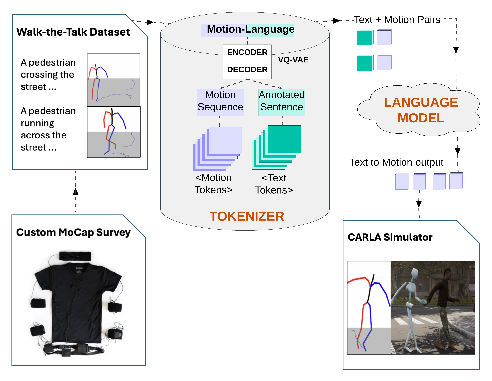

  <h1 style="color: #333; font-family: 'Segoe UI', Tahoma, Geneva, Verdana, sans-serif; font-size: 2.5rem;">Walk-the-Talk: LLM driven pedestrian motion generation</h1>

~~~python
A pedestrian walks towards a corsswalk by waving their right hand.
~~~

    

        <video src="assets/skeleton1.mov" loop autoplay style="width: 320px; height: 240px;"></video>
        
Animated Unreal Skeleton from Walk-the-Talk output

    

    

        <video src="assets/retarget1.mov" loop autoplay style="width: 320px; height: 240px;"></video>
        
Retargeted animation to a CARLA pedestrian

    

    

        <video src="assets/traffic1.mov" loop autoplay style="width: 320px; height: 240px;"></video>
        
Simulation with traffic

    

~~~python
A dizzy jaywalking pedestrian trips and leans onto a parked vehicle.
~~~

    

        <video src="assets/skeleton2.mov" loop autoplay style="width: 320px; height: 240px;"></video>
        
Animated Unreal Skeleton from Walk-the-Talk output

    

    

        <video src="assets/retarget2.mov" loop autoplay style="width: 320px; height: 240px;"></video>
        
Retargeted animation to a CARLA pedestrian

    

    

        <video src="assets/traffic2.mov" loop autoplay style="width: 320px; height: 240px;"></video>
        
Simulation with traffic

    

## Workflow

{: width="75%"}

    <b>Walk-the-Talk framework:</b> Using domain-specific data to generate realistic agent behaviours and motions for autonomous driving simulations utilizing Large Language Models.

## Paper Abstract

In the field of autonomous vehicles, a key chal-lenge is the “reality gap”: transferring knowledge gained insimulation to real-world settings. Despite various approachesto mitigate this gap, there’s a notable absence of solutionstargeting agent behavior generation, crucial for mimickingspontaneous, erratic, and realistic actions of traffic partici-pants. Recent advancements in Generative AI have enabledthe representation of human activities in semantic space andgenerate real human motion from textual descriptions. Despitecurrent limitations such as modality constraints, motion se-quence length, resource demands, and data specificity, there’san opportunity to innovate and use these techniques in theintelligent vehicles domain. We propose Walk-the-Talk, a motiongenerator utilizing Large Language Models (LLMs) to producereliable pedestrian motions for high-fidelity simulators like CARLA. Thus, we contribute to autonomous driving simu-lations by aiming to scale realistic, diverse long-tail agentmotion data - currently a gap in training datasets. We employMotion Capture (MoCap) techniques to develop the Walk-the-Talk dataset, which illustrates a broad spectrum of pedestrianbehaviors in street-crossing scenarios, ranging from standardwalking patterns to extreme behaviors such as drunk walkingand near-crash incidents. By utilizing this new dataset withina LLM, we facilitate the creation of realistic pedestrian motionsequences, a capability previously unattainable (cf. Figure 1).Additionally, our findings demonstrate that leveraging theWalk-the-Talk dataset enhances cross-domain generalization andsignificantly improves the Fr ́echet Inception Distance (FID)score by approximately 15% on the HumanML3D dataset.

## Some more examples

    

        <video src="assets/example1.mov" loop autoplay style="width: 320px; height: 240px;"></video>
        
2 People meeting in the parking lane.

    

    

        <video src="assets/example2.mov" loop autoplay style="width: 320px; height: 240px;"></video>
        
A drunk pedestrian falling in front of a car.

    

## Citation

## License and Usage

Visualizations are done using the work from [mViz](https://mviz.omid.al) by [Omid Alemi](https://omid.al/projects/). Site is built using "Biscuit" jekyll theme, which is derived from currently deprecated theme [Solo](http://github.com/chibicode/solo). The development of Biscuit is maintained by [Sefer Bora Lisesivdin](https://lrgresearch.org/bora). Biscuit and the previous code where Biscuit is derived are distributed with [MIT license](https://github.com/zybermonk/walk-the-talk/blob/main/LICENSE).
